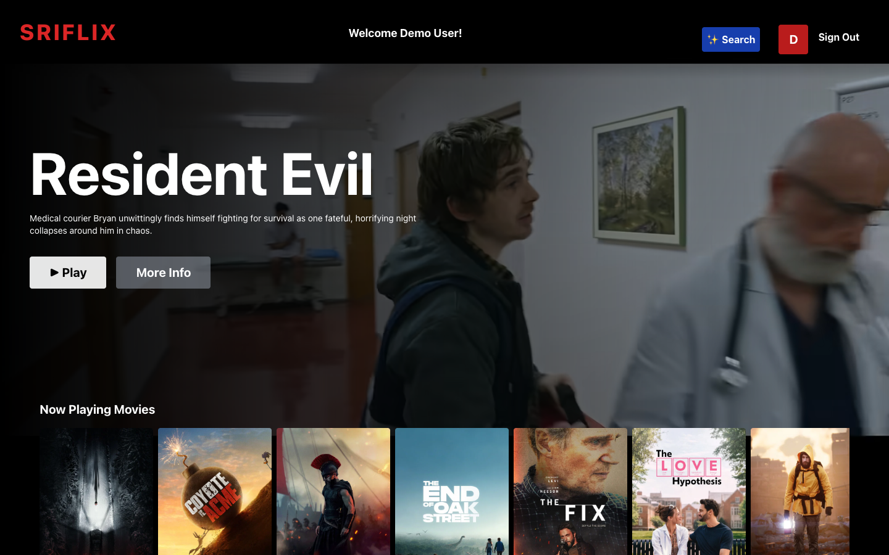
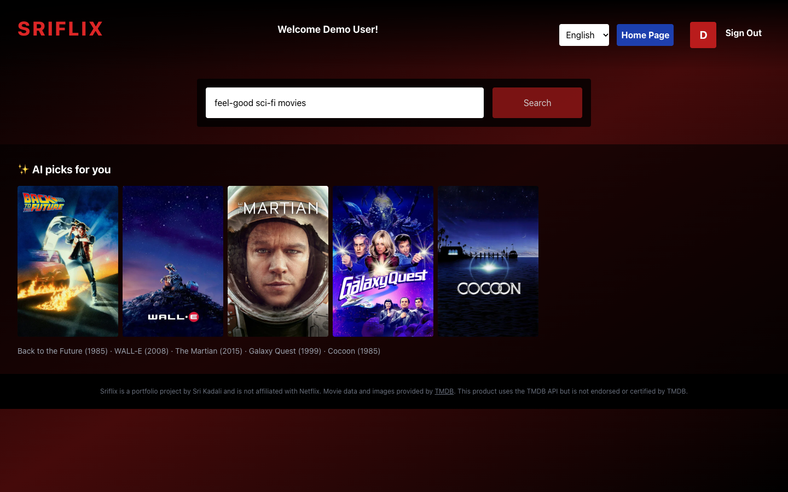
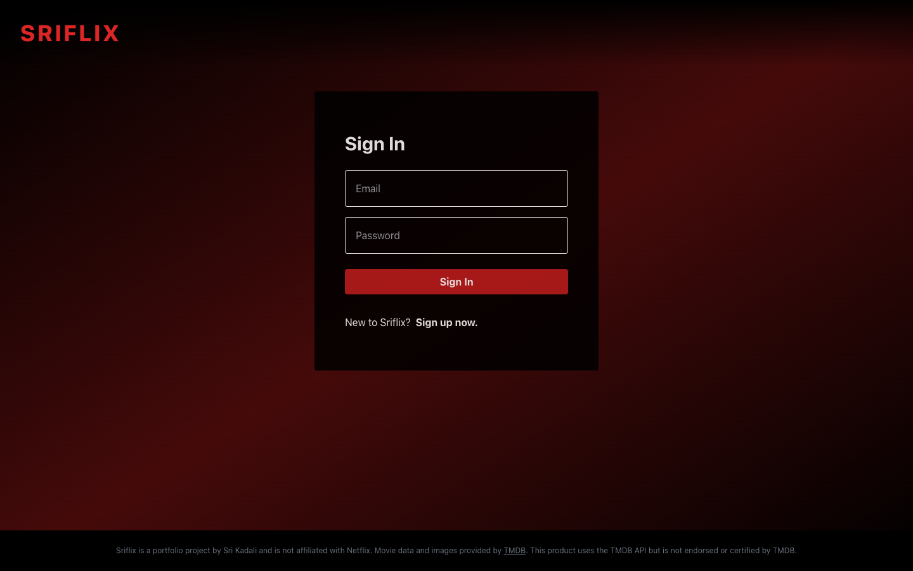

# Sriflix

A movie streaming web app with **AI-powered movie recommendations**. Describe what you're in the mood for ("feel-good sci-fi", "funny Telugu action movies") and Sriflix suggests five films, pulls their posters from TMDB, and shows them in browsable rows.

**Live demo:** https://sriflix-puce.vercel.app

**Demo login:** `demo@sriflix.app` / `SriflixDemo1` (or sign up with any email)



## Features

- **AI movie search:** natural-language recommendations from Google Gemini, matched to real TMDB titles by name and release year
- **Multi-language search UI:** English, Hindi, Spanish, Chinese, and Korean
- **Firebase Authentication:** email/password sign up and sign in, with auth-aware routing
- **Trailer hero banner:** autoplaying YouTube trailer for a now-playing movie
- **Trailer pop-up:** click any movie (or Play / More Info) to watch its YouTube trailer with the year, rating, and overview; closes with ✕, Esc, or a click outside
- **Movie rows:** now playing, top rated, and trending lists from TMDB with horizontal scrolling
- **No API keys in the browser:** all third-party calls go through serverless functions

| AI search | Sign in |
| --- | --- |
|  |  |

## Tech stack

| Layer | Tools |
| --- | --- |
| Frontend | React 19, Redux Toolkit, React Router, Tailwind CSS |
| Auth | Firebase Authentication |
| Serverless API | Vercel Functions (Node.js) |
| AI | Google Gemini API (structured JSON output) |
| Data | TMDB API |
| Hosting | Vercel |

## Architecture

```
Browser (React + Redux)
   │
   ├── Firebase Auth ─────────────── sign up / sign in
   │
   ├── GET  /api/tmdb?path=...  ──►  Vercel Function ──► TMDB API
   │        (allowlisted paths, CDN-cached for 1 hour)
   │
   └── POST /api/ai-search      ──►  Vercel Function ──► Gemini API (5 suggestions as JSON)
                                                     └─► TMDB search (in parallel)
```

**Why serverless functions?** The first version called OpenAI and TMDB directly from the browser, which meant the API keys were bundled into public JavaScript where anyone could copy them. Moving those calls into Vercel Functions keeps every secret on the server. The TMDB proxy only allows the endpoints the app needs, and responses are cached at the CDN so repeat visits don't hit TMDB at all.

**How AI search works:**

1. The browser sends the user's request to `/api/ai-search` with the user's Firebase ID token.
2. The function verifies the token against Google's public keys (signature, issuer, audience, expiry) and rejects anyone not signed in with a 401, so the endpoint can't be used to burn Gemini quota.
3. The function asks Gemini for 5 movies, using a JSON response schema (`title` + `year`) so the output is always parseable.
4. All 5 titles are searched on TMDB in parallel (`Promise.all`), filtered by release year, and ranked with exact title matches first.
5. The function returns the results in one response, and Redux stores them for the suggestion rows.

**State management:** Redux Toolkit slices hold the user, movie lists, the movie open in the trailer pop-up, AI search results, and language setting. Movie-list hooks skip the network call when the data is already in the store, so switching between pages doesn't refetch.

## Run locally

```bash
git clone https://github.com/sskadaliG/Sriflix.git
cd Sriflix
npm install
cp .env.example .env   # then fill in your keys
npm i -g vercel
vercel dev             # runs the React app and the /api functions together
```

You'll need:

- a free **TMDB** API read access token: https://www.themoviedb.org/settings/api
- a free **Gemini** API key: https://aistudio.google.com/apikey
- a **Firebase** project with Email/Password sign-in enabled

`npm start` also works for the UI alone, but the `/api` routes only run under `vercel dev` or on Vercel.

## Project structure

```
api/
  ai-search.js      Gemini + TMDB recommendation endpoint
  tmdb.js           allowlisted, cached TMDB proxy
src/
  components/       Header, Login, Browse, AI search, movie rows, trailer hero
  hooks/            data-fetching hooks for each movie list
  utils/            Redux slices, Firebase setup, TMDB client, constants
```

## Disclaimer

Sriflix is a portfolio project and is not affiliated with Netflix. Movie data and images are provided by [TMDB](https://www.themoviedb.org/). This product uses the TMDB API but is not endorsed or certified by TMDB.
